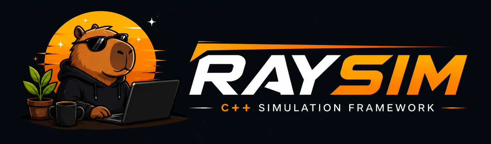
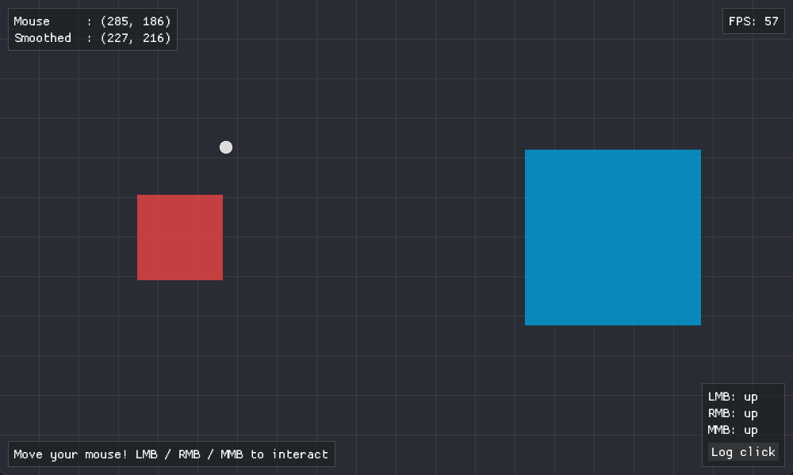
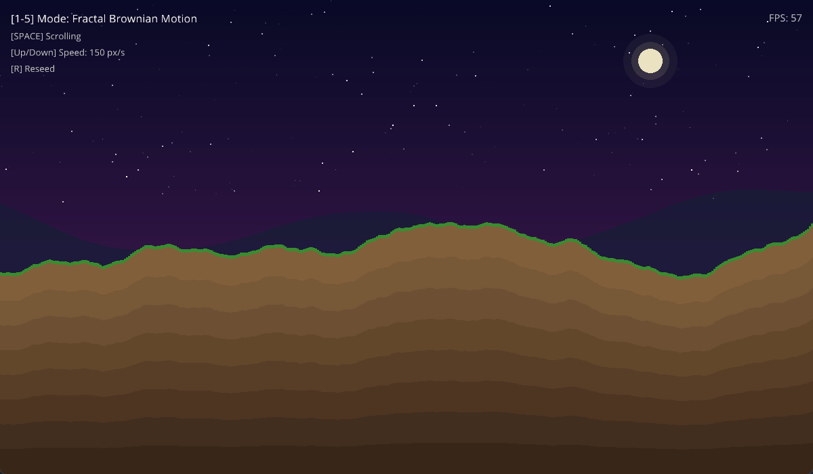
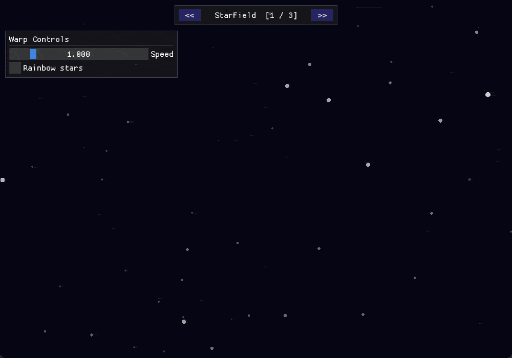
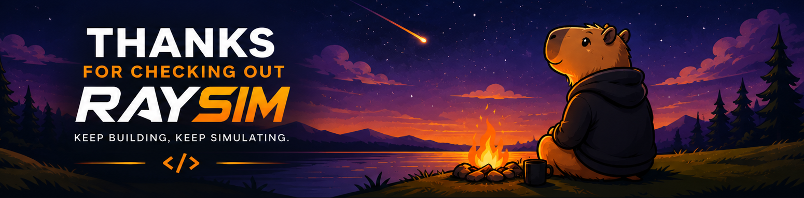

<p align="center">
  
</p>

[](https://isocpp.org/)
[](https://cmake.org/)

[](https://github.com/DMsuDev/Raysim/releases)
[](LICENSE)

[English Readme](https://github.com/DMsuDev/Raysim/blob/main/README.md)
• [Readme Español](https://github.com/DMsuDev/Raysim/blob/main/README.es.md)

Raysim es un framework de C++ para gráficos 2D y aplicaciones interactivas, construido sobre [raylib](https://www.raylib.com/).

Inspirado arquitectonicamente en el [**Hazel Engine de The Cherno**](https://github.com/TheCherno/Hazel), ofrece una API limpia basada en clases para dibujar formas, manejar entrada, gestionar el tiempo y ejecutar simulaciones con paso de tiempo fijo.

Útil para aprender programación gráfica, prototipar ideas o construir pequeños juegos y simulaciones.

> **Nota:** Este proyecto está en **Alpha**. La API puede cambiar sin previo aviso y algunas funcionalidades aún están en implementación. ¡Comentarios y contribuciones son bienvenidos!

## Demos Rápidos

<p align="center">
  <br />
  <b>Mouse2D</b>
</p>

<p align="center">
  <br />
  <b>NoiseLandscape</b>
</p>

<p align="center">
  <br />
  <b>SceneShowcase</b>
</p>

| Ejemplo           | Descripción                                                                             |
| ----------------- | --------------------------------------------------------------------------------------- |
| `BouncingBalls`   | Simulación de física con gravedad, atracción/repulsión del mouse y generación de bolas. |
| `LissajousCurves` | Visualizador de curvas paramétricas con cambio de fase animado y presets de frecuencia. |
| `Mouse2D`         | Seguimiento del mouse e interacción 2D.                                                 |
| `NoiseLandscape`  | Terreno con desplazamiento generado proceduralmente usando varias funciones de ruido.   |
| `SceneShowcase`   | Demo multi-escena navegable con ImGui: StarField, PlasmaArt y ClockMandala.             |

### Usando CMake Presets

Para compilar los ejemplos, habilita la opción `RS_BUILD_EXAMPLES` (ya habilitada en los presets):

```bash
cmake --preset debug
cmake --build --preset debug
```

> Cada ejemplo es un ejecutable independiente en `examples/` que demuestra diferentes funcionalidades del framework. Puedes ejecutarlos después de compilar el proyecto.

## Bucle de Aplicación

Cada ciclo de la aplicación ejecuta los métodos del ciclo de vida de la escena activa en orden.

<details>
<summary>OnAttach</summary>

Se llama una vez cuando la escena se adjunta por primera vez al SceneManager. Úsalo para
cargar assets, crear entidades e inicializar el estado de la escena.

```cpp
class MyScene : public Scene {
    RS_SCENE(MyScene) // Macro para generar ID y nombre de escena para lookup
protected:
    void OnAttach() override {
        GetWindow().SetTitle("Mi Escena");
    }
};
```

</details>

<details>
<summary>OnStart</summary>

Se llama cada vez que la escena comienza (después de `OnAttach` o cuando se reanuda). Úsalo para
reiniciar el estado del juego, reiniciar temporizadores o inicializar recursos dinámicos.

```cpp
void OnStart() override {
    position = {400, 300};
    velocity = {150, 100};
}
```

</details>

<details>
<summary>OnUpdate</summary>

Se llama cada frame. Úsalo para consultar la entrada, lógica del juego y todo lo que
lea o escriba estado de la simulación. Recibe el delta time escalado en segundos
para que el movimiento sea independiente del frame rate.

```cpp
void OnUpdate(float dt) override {
    if (GetInput().IsKeyPressed(KeyCode::Space)) foo();
    position += velocity * dt;
}
```

</details>

<details>
<summary>OnFixedUpdate</summary>

Se llama con un paso de tiempo fijo independientemente del frame rate real. Úsalo para
integración de física y pasos de simulación deterministas. El acumulador ejecuta
tantos pasos fijos como sea necesario para alcanzar el tiempo real, limitado por
`maxFixedSteps` de `ApplicationConfig` para evitar una espiral de la muerte.

```cpp
void OnFixedUpdate(float fixedDt) override {
    velocity += gravity * fixedDt;
    position += velocity * fixedDt;
}
```

</details>

<details>
<summary>OnDraw</summary>

Se llama cada frame después de `OnUpdate`. Emite todos los comandos de renderizado aquí.
Recibe un factor de interpolación `alpha` en `[0, 1)` que representa cuánto ha avanzado
la simulación hacia el siguiente paso fijo. Úsalo para interpolar entre la captura
de física anterior y la actual para que los visuales se mantengan suaves a cualquier
frame rate. No mutes estado dentro de `OnDraw`.

```cpp
void OnDraw(float alpha) override {
    GetRenderer().ClearScreen(Colors::DarkBlue);
    Vector2 renderPos = prevPosition + (position - prevPosition) * alpha;
    Shapes::DrawCircle(renderPos.x, renderPos.y, 20.0f, Colors::RayWhite);
}
```

> Usar un paso de Draw separado es ideal porque mantiene la estructura del código limpia y evita inconsistencias con el bucle de física. Sin embargo, es opcional. Si prefieres, puedes poner toda tu lógica de renderizado en OnUpdate y dejar OnDraw vacío. En ese caso, el parámetro `alpha` siempre será 0 ya que no hay interpolación, pero no causará ningún problema.

</details>

<details>
<summary>OnPause / OnResume</summary>

- `OnPause`: Se llama cuando la escena se pausa. Úsalo para pausar animaciones, detener temporizadores, etc.
- `OnResume`: Se llama cuando la escena se reanuda desde un estado de pausa. Úsalo para reanudar animaciones, reiniciar temporizadores, etc.

```cpp
void OnPause() override {
    RS_LOG_INFO("Escena pausada");
}

void OnResume() override {
    RS_LOG_INFO("Escena reanudada");
}
```

</details>

## Módulos

<details>
<summary>Core</summary>

| Archivo             | Propósito                                                                                                                                                                                       |
| ------------------- | ----------------------------------------------------------------------------------------------------------------------------------------------------------------------------------------------- |
| `Application`       | Clase base. Crea escenas y regístralas con `RegisterScene<T>()` o `ChangeScene<T>()`. Accede directamente a Window, Renderer e Input.                                                           |
| `ApplicationConfig` | Configura título, resolución, máximo de pasos fijos y archivo de log antes de que comience el bucle. Todos los campos tienen valores por defecto - pasa solo lo que necesites.                  |
| `Time`              | Utilidad estática. Delta time, paso de tiempo fijo, escala de tiempo, pausa/reanudar, contadores de FPS.                                                                                        |
| `Log`               | Envuelve spdlog. Escribe en consola y archivo de log. Usa las macros `RS_LOG_INFO`, `RS_LOG_WARN`, `RS_LOG_ERROR`.                                                                              |
| `FontManager`       | Carga una fuente TTF/OTF una vez, accede globalmente para renderizado de texto. Puedes establecer una fuente por defecto usando `SetDefaultFont("ruta/fuente.ttf")` en `OnAttach() override`.   |
| `BackendFactory`    | Crea instancias concretas de `RendererAPI`, `Window` e `Input` para el backend seleccionado.                                                                                                    |
| `Scene`             | Clase base para escenas. Proporciona callbacks del ciclo de vida (OnStart, OnUpdate, OnFixedUpdate, OnDraw, OnPause, OnResume). Las escenas reciben un EngineContext para acceso a subsistemas. |
| `SceneManager`      | Gestionar escenas. Soporta operaciones de push/pop, pausa/reanudar y búsqueda de escenas por ID o nombre.                                                                                       |

</details>

<details>
<summary>Scene</summary>

El sistema de escenas proporciona una forma estructurada de organizar tu aplicación en escenas independientes (menú principal, juego, pantalla de pausa, etc.), cada una con su propio ciclo de vida y acceso a los subsistemas del motor.

**¿Cómo crear una escena?**

Para crear una escena, hereda de la clase `Scene` y usa el macro `RS_SCENE(MiEscena)` dentro de la definición para registrar el nombre e ID de la escena automáticamente:

```cpp
class MiEscena : public Scene {
    RS_SCENE(MiEscena)
    // ... métodos override como OnAttach, OnUpdate, etc.
};
```

Luego, registra la escena en tu aplicación usando `RegisterScene`:

```cpp
app->RegisterScene<MiEscena>();
```

Hay que registrar la escena antes de poder usarla. Usa `ChangeScene<T>()` para activarla:

```cpp
RS::Application* RS::CreateApplication(RS::ApplicationCommandLineArgs args)
{
    RS::ApplicationConfig config;
    config.Window.Title = "Mi App";

    auto* app = new RS::Application(config);
    app->RegisterScene<MiEscena>();
    app->ChangeScene<MiEscena>();
    return app;
}
```

Puedes cambiar a cualquier escena registrada en cualquier momento llamando a `ChangeScene<T>()` o por nombre/ID a través de `SceneManager`.

</details>

<details>
<summary>Graphics</summary>

| Archivo      | Propósito                                                                                                                                                                                                    |
| ------------ | ------------------------------------------------------------------------------------------------------------------------------------------------------------------------------------------------------------ |
| `Shapes`     | Rellenos y contornos: rectángulos, círculos, líneas, triángulos. Cada función acepta un `OriginMode` opcional para anclar la forma en su centro o cualquier esquina/borde en lugar del top-left por defecto. |
| `Texts`      | Dibuja cadenas de texto usando la fuente cargada.                                                                                                                                                            |
| `Color`      | Struct de color RGBA `{r, g, b, a}` con conversión HSV. Construye cualquier color inline: `Color{255, 100, 0}`.                                                                                              |
| `Colors`     | Namespace de presets `constexpr`: `Colors::White`, `Colors::Black`, `Colors::Cyan`, `Colors::DarkBlue`, `Colors::RayBlack`, y más. Úsalos en lugar de construir colores a mano.                              |
| `OriginMode` | Enum usado por Shapes para controlar el punto de anclaje de una forma (TopLeft, Center, BottomRight, etc.).                                                                                                  |

</details>

<details>
<summary>Math</summary>

| Archivo      | Propósito                                                                                                                                                                                                                                                                                                                          |
| ------------ | ---------------------------------------------------------------------------------------------------------------------------------------------------------------------------------------------------------------------------------------------------------------------------------------------------------------------------------- |
| `Vector2`    | Vector 2D con operadores aritméticos y métodos de utilidad comunes.                                                                                                                                                                                                                                                                |
| `Vector2Int` | Vector 2D de enteros con operadores aritméticos y métodos de utilidad comunes.                                                                                                                                                                                                                                                     |
| `Vector3`    | Vector 3D, usado internamente para operaciones de color/limpieza y matemáticas generales.                                                                                                                                                                                                                                          |
| `Vector3Int` | Vector 3D de enteros con operadores aritméticos y métodos de utilidad comunes.                                                                                                                                                                                                                                                     |
| `Math`       | Helpers matemáticos comunes: clamp, lerp, map, wrap y utilidades trigonométricas.                                                                                                                                                                                                                                                  |
| `Random`     | RNG Mersenne Twister con semilla. Rangos de enteros y flotantes, helpers booleanos, muestreo de contenedores, más ruido coherente (Perlin 2D/3D, Simplex, Cellular, Value) y Fractal Brownian Motion. La semilla es auto-aleatoria al inicio; llama a `Seed()` para resultados deterministas o `SeedRandom()` para re-aleatorizar. |

</details>

<details>
<summary>Interfaces y Backend</summary>

Cinco interfaces abstractas desacoplan el código del usuario de la librería subyacente:

| Interfaz       | Responsabilidad                                              |
| -------------- | ------------------------------------------------------------ |
| `RendererAPI`  | Inicio/fin de frame, limpieza de pantalla, control VSync.    |
| `Window`       | Título, tamaño, fullscreen, relación de aspecto.             |
| `Input`        | Teclado, botones del mouse, posición del cursor, scroll.     |
| `ImGuiBackend` | Inicialización, apagado y ciclo de vida por frame de ImGui.  |
| `FontRenderer` | Carga de fuentes, medición de glifos y renderizado de texto. |

El backend de `Raylib` es la única implementación incluida. `RaylibRendererAPI`,
`RaylibWindow`, `RaylibInput`, `RaylibImGuiBackend` y `RaylibFontRenderer`
satisfacen cada interfaz. Todos los headers específicos del backend están
confinados a esta capa y nunca se filtran al código del usuario.

</details>

<details>
<summary>Integración con ImGui</summary>

Un `ImGuiLayer` está integrado para overlays de debug y paneles de UI. Agrégalo al layer stack de una escena e implementa `OnUIRender()` en cualquier subclase de `Layer` para dibujar widgets de ImGui.

```cpp
class MiOverlay : public Layer {
public:
    MiOverlay() : Layer("MiOverlay") {}
    void OnUIRender() override {
        ImGui::Begin("Debug");
        ImGui::Text("Hola desde ImGui!");
        ImGui::End();
    }
};
```

</details>

## Compilación

Requisitos mínimos: **CMake 3.28**, **C++20** y **Ninja**.
Las dependencias se gestionan mediante [vcpkg](https://vcpkg.io/) (incluido como submódulo).

> **macOS:** El soporte para macOS aún no ha sido probado. El sistema de compilación y las dependencias deberían funcionar en teoría, pero la compatibilidad no está garantizada y pueden existir problemas sin descubrir.

### Configuración inicial

```bash
# Inicializa vcpkg e instala las dependencias
./tools/setup_all.sh       # Linux / macOS
.\tools\setup_all.ps1      # Windows (PowerShell)
```

### Usando CMake Presets

```bash
cmake --preset debug              # Configurar Debug (Ninja)
cmake --build --preset debug      # Compilar Debug

cmake --preset release            # Configurar Release (Ninja)
cmake --build --preset release    # Compilar Release
```

> **Sanitizers:** El preset `debug` habilita ASan y UBSan por defecto. El soporte de sanitizers es **experimental** y aún está en fase de pruebas, pueden aparecer problemas según el toolchain o la plataforma. En MinGW, los sanitizers se deshabilitan automáticamente.

### CMake Manual

> **Nota:** Al no usar presets, debes pasar el archivo de toolchain de vcpkg manualmente para que CMake pueda encontrar las dependencias instaladas.

Los comandos correctos dependen del generador que elijas. **Ninja** (single-config) y **Visual Studio** (multi-config) manejan el tipo de compilación de forma diferente, mezclar sus flags es una fuente común de errores.

#### Con Ninja (recomendado, funciona en todas las plataformas)

Ninja requiere que el tipo de compilación se defina en el momento de **configuración** con `-DCMAKE_BUILD_TYPE`. El flag `--config` no se usa al compilar.

```bash
cmake -B build -G Ninja \
  -DCMAKE_TOOLCHAIN_FILE=vcpkg/scripts/buildsystems/vcpkg.cmake \
  -DCMAKE_BUILD_TYPE=Release \
  -DRS_BUILD_EXAMPLES=ON
cmake --build build
```

#### Con Visual Studio (solo Windows)

Visual Studio es un generador multi-config: ignora `-DCMAKE_BUILD_TYPE` y en su lugar requiere `--config` en el momento de **compilación**. También debes especificar la arquitectura con `-A x64`.

```bash
cmake -B build -G "Visual Studio 17 2022" -A x64 \
  -DCMAKE_TOOLCHAIN_FILE=vcpkg/scripts/buildsystems/vcpkg.cmake \
  -DRS_BUILD_EXAMPLES=ON
cmake --build build --config Release
```

## Inicio Rápido

Crea una escena heredando de `Scene` y sobreescribe los métodos del ciclo de vida. Configura la app con `ApplicationConfig`, registra tu escena y llama a `ChangeScene<T>()` para activarla.

```cpp
#include "Raysim/Raysim.hpp"
#include "Raysim/Core/EntryPoint.hpp"

using namespace RS;

class MyScene : public Scene {
    RS_SCENE(MyScene)

private:
    Math::Vec2 position = {400, 300};
    Math::Vec2 velocity = {150, 100};

    void OnFixedUpdate(float fixedDt) override {
        position += velocity * fixedDt;

        float width  = static_cast<float>(GetWindow().GetWidth());
        float height = static_cast<float>(GetWindow().GetHeight());

        if (position.x < 20 || position.x > width  - 20) velocity.x *= -1;
        if (position.y < 20 || position.y > height - 20) velocity.y *= -1;
    }

    void OnDraw(float alpha) override {
        GetRenderer().ClearScreen(Colors::DarkBlue);
        Shapes::DrawCircle(position.x, position.y, 20.0f, Colors::RayWhite);
    }
};

RS::Application* RS::CreateApplication(RS::ApplicationCommandLineArgs args)
{
    RS::ApplicationConfig config;
    config.Window.Title  = "Mi Primera App Raysim";
    config.Window.Width  = 800;
    config.Window.Height = 600;

    auto* app = new RS::Application(config);
    app->RegisterScene<MyScene>();
    app->ChangeScene<MyScene>();
    return app;
}
```

> **Tip:** La semilla es auto-aleatoria al inicio. Llama a `SetRandomSeed(valor)` en `OnAttach()` solo si necesitas reproducibilidad.

## Licencia

Este proyecto está licenciado bajo la **Apache License 2.0**.
Consulta el archivo [LICENSE](LICENSE) para más detalles.

<p align="center">
  
</p>
