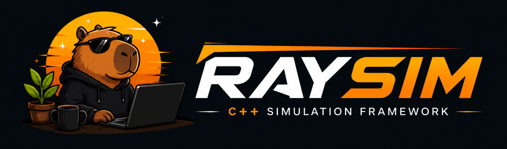
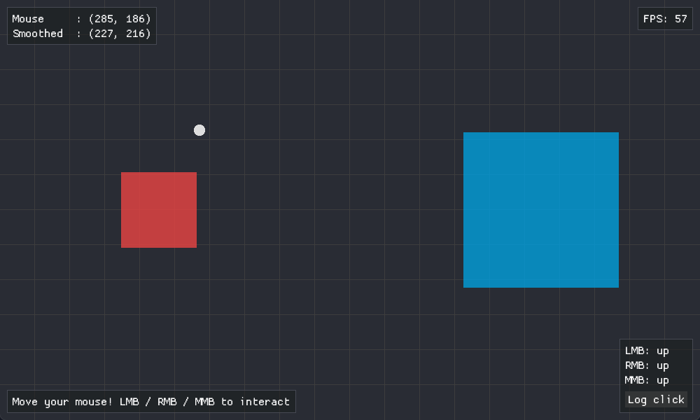
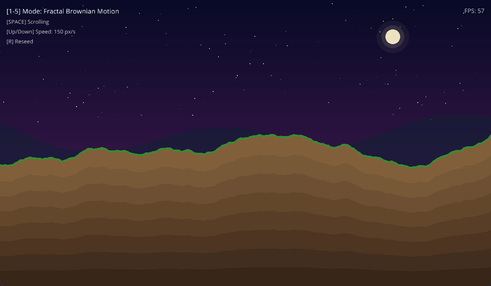
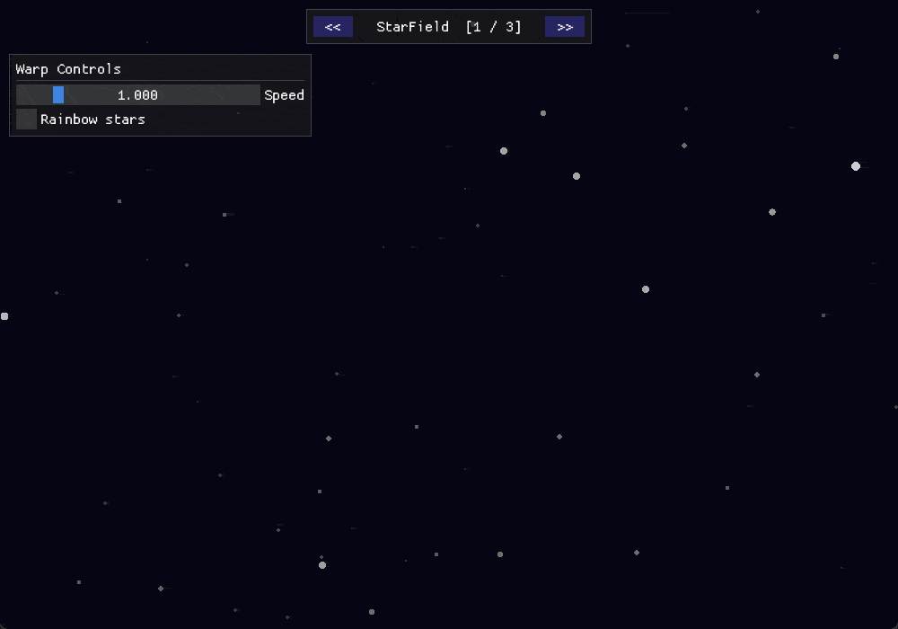
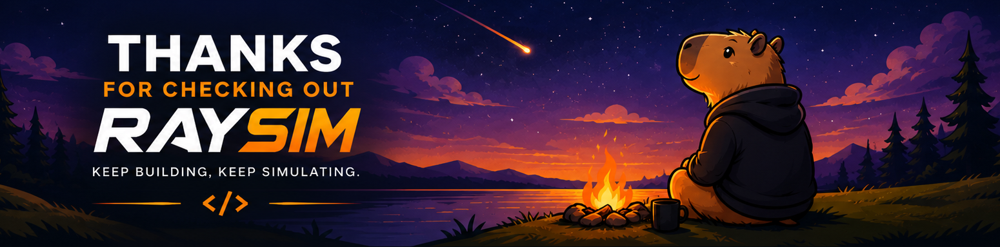

<p align="center">
  
</p>

<div align="center">

[](https://isocpp.org/)
[](https://cmake.org/)

[](https://github.com/DMsuDev/Raysim/actions/workflows/ci-build.yml)
[](https://github.com/DMsuDev/RaySim/releases/latest)
[](LICENSE)

</div>

[English Readme](https://github.com/DMsuDev/Raysim/blob/main/README.md)
• [Readme Español](https://github.com/DMsuDev/Raysim/blob/main/README.es.md)
• [Changelog](docs/CHANGELOG.md)
• [Architecture](docs/ARCHITECTURE.md)

---

**Raysim** es un framework experimental en C++ para gráficos 2D y aplicaciones interactivas, construido sobre [raylib](https://www.raylib.com/) e inspirado en la arquitectura de [**The Cherno's Hazel Engine**](https://github.com/TheCherno/Hazel).

Nació como un proyecto personal de aprendizaje para explorar patrones de diseño en motores gráficos, abstraer pipelines de renderizado y profundizar en el desarrollo con C++.

Ofrece una capa de abstracción orientada a objetos que simplifica la creación de ventanas, el manejo de entrada, la gestión de estados mediante escenas y el control del bucle de tiempo fijo (*fixed timestep*). Su objetivo es proporcionar una base lista para prototipar ideas, simular físicas o desarrollar pequeños juegos sin perder tiempo montando la infraestructura básica.

Cualquier comentario o contribución es bienvenido. ❤️

> [!NOTE]
> Este proyecto está en estado **Beta** y en desarrollo activo. La API evoluciona continuamente a medida que se adoptan mejores prácticas.

## Galería

<table>
  <tr>
    <td width="240" align="center">
      
    </td>
    <td valign="top">

**Mouse2D**

Rastrea el cursor del ratón mediante una interpolación exponencial suave y dibuja un círculo seguidor. Excelente punto de entrada para comprender el flujo de trabajo de entrada y renderizado.

`input` `interpolation` `rendering`

</td>
  </tr>
  <tr>
    <td width="240" align="center">
      
    </td>
    <td valign="top">

**NoiseLandscape**

Terreno en desplazamiento generado procedimentalmente y renderizado en pases superpuestos utilizando ruido Perlin, Simplex, Celular y Value. Presiona `R` para reiniciar la semilla de todas las capas.

`procedural` `noise` `perlin`

</td>
  </tr>
  <tr>
    <td width="240" align="center">
      
    </td>
    <td valign="top">

**SceneShowcase**

Tres escenas visuales independientes (`StarField`, `PlasmaArt`, `ClockMandala`) accesibles desde un panel de navegación compartido de ImGui. Muestra el cambio dinámico de escenas en tiempo de ejecución utilizando `SceneManager`.

`scene-manager` `imgui` `runtime`

</td>
  </tr>
</table>

## Requisitos

| Herramienta | Versión | Notas |
| :--- | :--- | :--- |
| **CMake** | 3.28+ | Generador del sistema de compilación |
| **Compilador C++** | C++20 | GCC 10+, Clang 12+ (Linux) · MSVC 2022 (Windows) |
| **Ninja** | Cualquiera | Generador de compilación recomendado |
| **vcpkg** | Cualquiera | Gestor de paquetes (requiere la variable de entorno `VCPKG_ROOT`) |

## Compilación

Raysim soporta oficialmente:

- **Linux** (Debian/Ubuntu recomendado)
- **Windows 10/11**
- **macOS** (no probado oficialmente; teóricamente debería funcionar)

### 1. Clonar el repositorio

```bash
git clone https://github.com/DMsuDev/raysim.git
cd raysim
```

### 2. Compilar

<details open>
<summary><strong>Opción A: CMake Presets (Recomendado)</strong></summary>

Los *presets* gestionan automáticamente la configuración, las rutas de la cadena de herramientas (*toolchain*) y las banderas de sanitizadores:

```bash
# Compilación en modo Debug (ASan + UBSan habilitados donde sea compatible)
cmake --preset debug
cmake --build --preset debug

# Compilación en modo Release
cmake --preset release
cmake --build --preset release
```

> [!WARNING]
> El soporte de sanitizadores depende del compilador utilizado. En MinGW, los sanitizadores se desactivan automáticamente.

</details>

<details>
<summary><strong>Opción B: Compilación personalizada</strong></summary>

Si prefieres un control explícito o no usas *presets*, especifica manualmente el archivo de la cadena de herramientas (*toolchain*) de vcpkg.

**Linux / macOS / Windows (Generador Ninja)**

```bash
cmake -B build -G Ninja \
  -DCMAKE_TOOLCHAIN_FILE=$VCPKG_ROOT/scripts/buildsystems/vcpkg.cmake \
  -DCMAKE_BUILD_TYPE=Release \
  -DRS_BUILD_EXAMPLES=ON

cmake --build build
```

**Windows (PowerShell + Visual Studio)**

```powershell
cmake -B build -G "Visual Studio 18 2026" -A x64 `
  -DCMAKE_TOOLCHAIN_FILE="$env:VCPKG_ROOT\scripts\buildsystems\vcpkg.cmake" `
  -DRS_BUILD_EXAMPLES=ON

cmake --build build --config Release
```

</details>

## Inicio Rápido

Una aplicación en Raysim se construye alrededor de **escenas**. Cada escena gestiona su propio ciclo de vida, renderizado e interacción: basta con registrarla en la `Application`, activarla y el motor se encarga del resto.

La macro `RS_SCENE` registra el tipo en el sistema de escenas y genera su constructor automáticamente. Sobrescribe únicamente las funciones que necesites; por defecto, todas son operaciones vacías (*no-ops*):

| Callback | Cuándo se ejecuta |
| :--- | :--- |
| `OnAttach` | Una sola vez, al apilar la escena. Ideal para cargar recursos y suscribirse a eventos. |
| `OnStart` | Cada vez que la escena pasa a estar activa. Úsalo para reiniciar el estado. |
| `OnUpdate(dt)` | En cada fotograma. Para lectura de entradas (*polling*) y lógica con tasa variable. |
| `OnFixedUpdate(fixedDt)` | Intervalo de tiempo fijo (*fixed timestep*). Para física y simulación determinista. |
| `OnDraw(alpha)` | En cada fotograma, tras `OnUpdate`. Todo el renderizado se realiza aquí. |
| `OnDetach` | Al remover la escena. Libera recursos y cancela suscripciones a eventos. |

Para consultar la referencia completa del ciclo de vida, incluyendo eventos, capas y la interpolación física, revisa la documentación de [Arquitectura](docs/ARCHITECTURE.md).

El siguiente ejemplo crea una pelota que rebota dentro de los límites de la ventana:

```cpp
#include "Raysim/Raysim.hpp"
#include "Raysim/Core/EntryPoint.hpp"

using namespace RS;

class MyScene : public Scene {
    RS_SCENE(MyScene)

private:
    Math::Vec2f position = {400.0f, 300.0f};
    Math::Vec2f velocity = {150.0f, 100.0f};

    void OnFixedUpdate(float fixedDt) override {
        position += velocity * fixedDt;

        float width  = static_cast<float>(window().GetWidth());
        float height = static_cast<float>(window().GetHeight());

        if (position.x < 20 || position.x > width  - 20) velocity.x *= -1;
        if (position.y < 20 || position.y > height - 20) velocity.y *= -1;
    }

    void OnDraw(float /*alpha*/) override {
        renderer().ClearScreen(Colors::DarkBlue);
        Shapes::DrawCircle(position.x, position.y, 20.0f, Colors::RayWhite);
    }
};

RS::Application* RS::CreateApplication(RS::ApplicationCommandLineArgs args)
{
    RS::ApplicationConfig config;
    config.Window.Title  = "My First Scene";
    config.Window.Width  = 800;
    config.Window.Height = 600;

    auto* app = new RS::Application(config);
    app->RegisterScene<MyScene>();
    app->ChangeScene<MyScene>();
    return app;
}
```

La lógica física pertenece a `OnFixedUpdate`: el motor la ejecuta a un paso de tiempo fijo, de forma independiente a la tasa de fotogramas. La función `OnDraw` recibe un factor de interpolación `alpha` para suavizar el renderizado entre pasos de física; en este ejemplo se omite la interpolación por brevedad.

Para un uso detallado de cada módulo (entradas, eventos, capas, matemáticas, ImGui), consulta la [Guía](docs/GUIDE.md). Si buscas demostraciones ejecutables con código fuente completo, explora el directorio [`examples/`](examples/).

## Contribuir

¡Las contribuciones son siempre bienvenidas! ❤️ Ya sea que quieras reportar errores, solucionar problemas, añadir nuevos ejemplos o mejorar la documentación, tu ayuda es apreciada.

Antes de abrir un *pull request*:

- Mantén las solicitudes enfocadas: prioriza PRs pequeñas y atómicas que resuelvan una sola característica o corrección.
- Escribe mensajes de commit claros usando [Conventional Commits](https://www.conventionalcommits.org/).
- Asegúrate de que el proyecto compile limpiamente sin introducir nuevos avisos (warnings) del compilador.

Para cambios mayores o nuevas características, abre una *issue* primero para discutir lo que te gustaría cambiar.

## Licencia

Este proyecto está bajo la licencia **Apache License 2.0**.
Consulta el archivo [LICENSE](LICENSE) para más detalles.

<p align="center">
  
</p>
