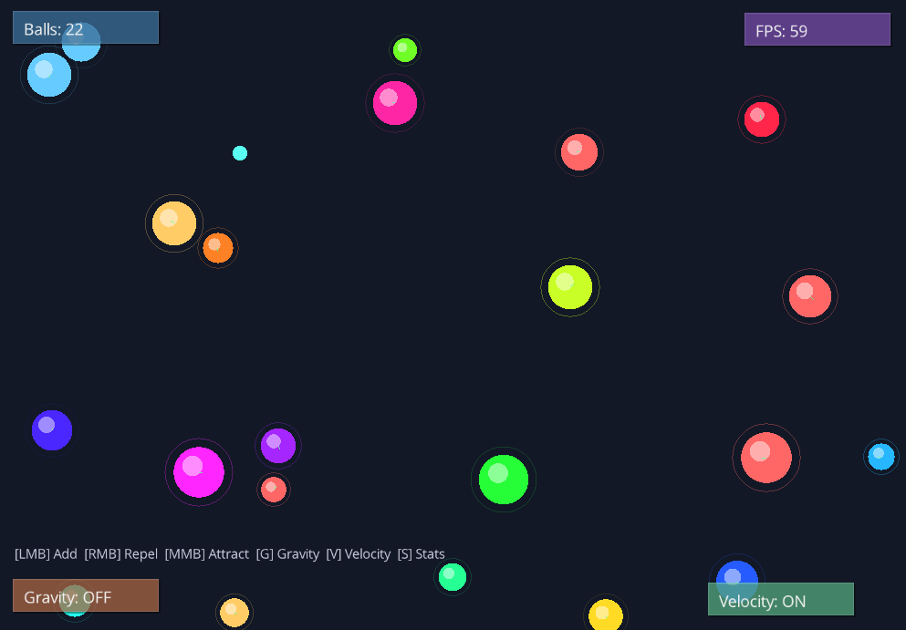
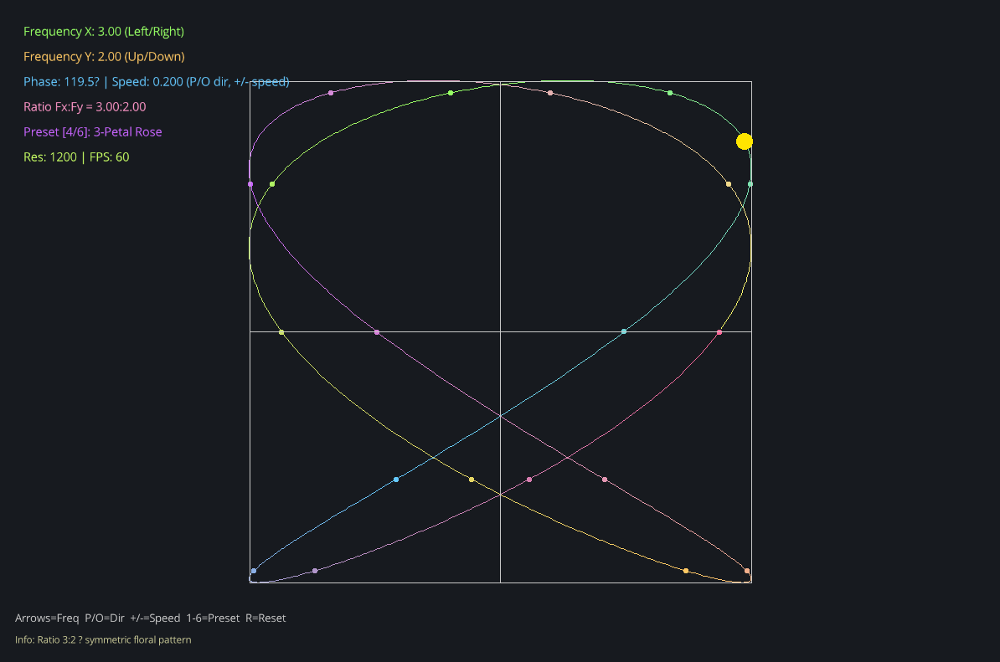
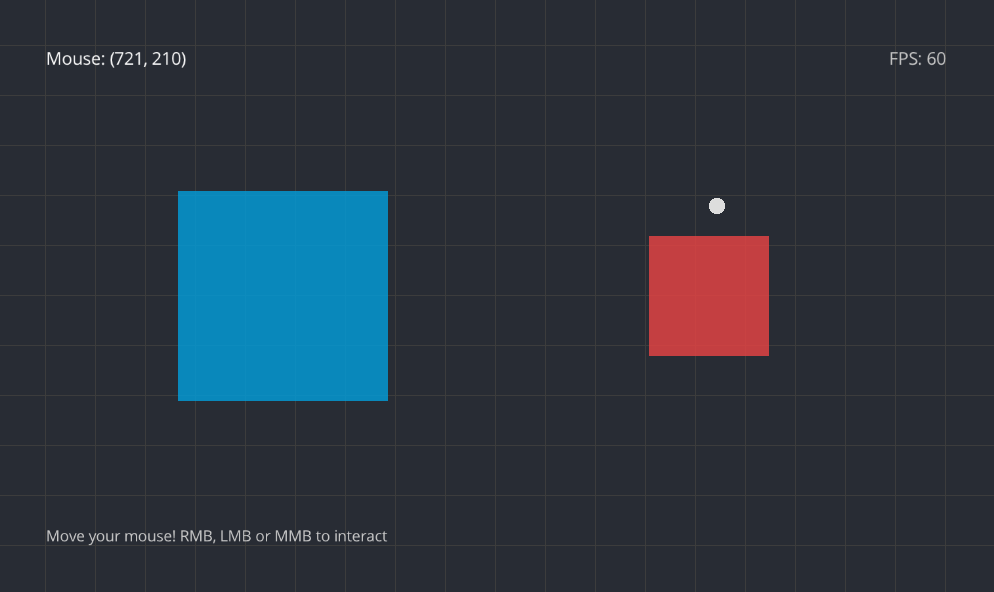
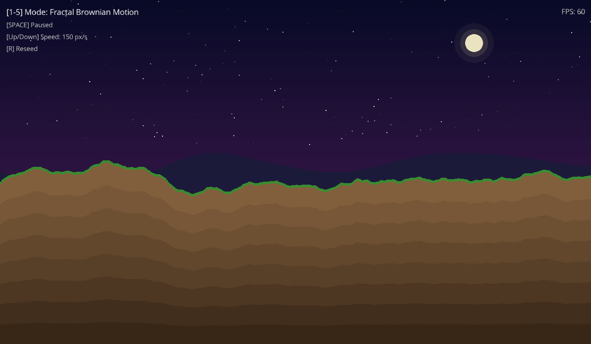

# Raysim

[](https://isocpp.org/)
[](https://cmake.org/)

[](https://github.com/DMsuDev/Raysim/releases)

[English Readme](https://github.com/DMsuDev/Raysim/blob/main/README.md)
• [Readme Español](https://github.com/DMsuDev/Raysim/blob/main/README.es.md)

Raysim is a C++ framework for 2D graphics and interactive applications, built on top of [raylib](https://www.raylib.com/).

Inspired by **p5.js** and **Processing**, it provides a simple class-based API for drawing shapes, handling input, managing time, and running fixed-timestep simulations. Backend headers are never exposed to user code -- all access goes through clean abstract interfaces.

Useful for learning graphics programming, prototyping ideas, or building small games and simulations.

> **Note:** This project is in **early development**. The API may change without warning, and some features are still being implemented. It is my first time developing a C++ framework. Feedback and contributions are welcome!

## Quick Demos

<!-- Screenshots or GIF.
    TODO:
-->

<table>
  <tr>
    <td align="center">
      <br />
      <b>BouncingBalls</b>
    </td>
    <td align="center">
      <br />
      <b>LissajousCurves</b>
    </td>
  </tr>
  <tr>
    <td align="center">
      <br />
      <b>Mouse2D</b>
    </td>
    <td align="center">
      <br />
      <b>NoiseLandscape</b>
    </td>
  </tr>
</table>

| Example           | Description                                                                             |
| ----------------- | --------------------------------------------------------------------------------------- |
| `BouncingBalls`   | Physics simulation with gravity, mouse attraction/repulsion, and ball spawning.         |
| `LissajousCurves` | Parametric curve visualiser with animated phase shift and selectable frequency presets. |
| `Mouse2D`         | Mouse tracking and 2D interaction.                                                      |
| `NoiseLandscape`  | Procedurally generated scrolling terrain using various noise functions.                 |

### Using Makefile

```bash
make example-bouncing
make example-lissajous
make example-mouse
make example-noise
```

### Using CMake Presets

To compile the examples, enable the `RS_BUILD_EXAMPLES` option (already enabled in presets):

```bash
cmake --preset debug
cmake --build --preset debug
```

> Each example is a standalone executable in `examples/` that demonstrates different features of the framework. You can run them after building the project.

## Application Loop

Each application cycle runs through the active scene's lifecycle methods in order.

<details>
<summary>OnAttach</summary>

Called once when the scene is first attached to the SceneManager. Use it to
load assets, create entities, and initialise scene state.

```cpp
class MyScene : public Scene {
protected:
    void OnAttach() override {
        GetContext().Window->SetTitle("My Scene");
    }
};
```

</details>

<details>
<summary>OnStart</summary>

Called each time the scene starts (after `OnAttach` or when resumed). Use it to
reset game state, restart timers, or initialise dynamic resources.

```cpp
void OnStart() override {
    position = {400, 300};
    velocity = {150, 100};
}
```

</details>

<details>
<summary>OnUpdate</summary>

Called every frame. Use it for input polling, game logic, and anything that
reads or writes simulation state. Receives the scaled delta time in seconds
so movement stays frame-rate independent.

```cpp
void OnUpdate(float dt) override {
    if (GetContext().Input->IsKeyPressed(Key::Space)) SetPaused(!IsPaused());
    position += velocity * dt;
}
```

</details>

<details>
<summary>OnFixedUpdate</summary>

Called at a fixed timestep regardless of the actual frame rate. Use it for
physics integration and deterministic simulation steps. The accumulator runs
as many fixed steps as needed to catch up with real time, capped by
`maxFixedSteps` of `ApplicationConfig` to avoid a spiral of death.

```cpp
void OnFixedUpdate(float fixedDt) override {
    velocity += gravity * fixedDt;
    position += velocity * fixedDt;
}
```

</details>

<details>
<summary>OnDraw</summary>

Called every frame after `OnUpdate`. Issue all rendering commands here.
Receives an interpolation factor `alpha` in `[0, 1)` representing how far
the simulation has advanced into the next fixed step. Use it to lerp between
the previous and current physics snapshot so visuals stay smooth at any
frame rate. Do not mutate state inside `OnDraw`.

```cpp
void OnDraw(float alpha) override {
    GetContext().Renderer->Clear(Colors::DarkBlue);
    Vector2 renderPos = prevPosition + (position - prevPosition) * alpha;
    Shapes::DrawCircle(renderPos.x, renderPos.y, 20.0f, Colors::RayWhite);
}
```

> Using a separate Draw step is ideal because it keeps code structure clean and avoids inconsistencies with the physics loop. However, it's optional. If you prefer, you can put all your rendering logic in OnUpdate and leave OnDraw empty. In that case, the `alpha` parameter will always be 0 since there's no interpolation happening, but it won't cause any issues.

</details>

<details>
<summary>OnPause / OnResume</summary>

- `OnPause`: Called when the scene is paused. Use it to pause animations, stop timers, etc.
- `OnResume`: Called when the scene is resumed from a paused state. Use it to resume animations, restart timers, etc.

```cpp
void OnPause() override {
    RS_LOG_INFO("Scene paused");
}

void OnResume() override {
    RS_LOG_INFO("Scene resumed");
}
```

</details>

<details>
<summary>OnDetach</summary>

Called when the scene is removed or replaced. Clean up resources, detach entities, etc.

```cpp
void OnDetach() override {
    // Clean up scene resources
}
```

</details>

## Modules

<details>
<summary>Core</summary>

| File                | Purpose                                                                                                                                                                                      |
| ------------------- | -------------------------------------------------------------------------------------------------------------------------------------------------------------------------------------------- |
| `Application`       | Base class. Create scenes and register them with `SetScene()` or `AddScene()`. Access backend through `GetContext()`.                                                                        |
| `ApplicationConfig` | Configure title, resolution, max fixed steps, and log file before the loop starts. All fields have defaults - pass only what you need.                                                       |
| `Time`              | Static utility. Delta time, fixed timestep, time scale, pause/resume, FPS counters.                                                                                                          |
| `Log`               | Wraps spdlog. Writes to console and a log file. Use macros `RS_LOG_INFO`, `RS_LOG_WARN`, `RS_LOG_ERROR`.                                                                                     |
| `FontManager`       | Load a TTF/OTF font once, access it globally for text rendering. You can set a default font using `SetDefaultFont("path/to/font.ttf")` on `OnAttach() override`.                             |
| `BackendFactory`    | Creates concrete `RendererAPI`, `Window`, and `Input` instances for the selected backend.                                                                                                    |
| `Scene`             | Base class for scenes. Provides lifecycle callbacks (OnAttach, OnStart, OnUpdate, OnFixedUpdate, OnDraw, OnPause, OnResume, OnDetach). Scenes receive an EngineContext for subsystem access. |
| `SceneManager`      | Manages a LIFO stack of scenes. Supports push/pop operations, pause/resume, and scene lookup by ID or name.                                                                                  |

</details>

<details>
<summary>Scene</summary>

| File           | Purpose                                                                                                                                                                                                                                 |
| -------------- | --------------------------------------------------------------------------------------------------------------------------------------------------------------------------------------------------------------------------------------- |
| `Scene`        | Base class for scenes. Provides lifecycle callbacks (OnStart, OnUpdate, OnFixedUpdate, OnDraw, OnAttach, OnDetach, OnPause, OnResume). Each scene receives an EngineContext for Window, Renderer, and Input access.                     |
| `SceneManager` | Manages a LIFO stack of scenes. Operations: AddScene (push), RemoveScene (pop), SetScene (replace all). Flow control: PauseCurrentScene, ResumeCurrentScene. Lookup: GetCurrentScene, GetSceneByID, GetSceneByName, GetUnderlyingScene. |

</details>

<details>
<summary>Graphics</summary>

| File         | Purpose                                                                                                                                                                                          |
| ------------ | ------------------------------------------------------------------------------------------------------------------------------------------------------------------------------------------------ |
| `Shapes`     | Filled and outlined: rectangles, circles, lines, triangles. Each function accepts an optional `OriginMode` to anchor the shape at its center or any corner/edge instead of the default top-left. |
| `Texts`      | Draw text strings using the loaded font.                                                                                                                                                         |
| `Color`      | RGBA color struct `{r, g, b, a}` with HSV conversion. Build any color inline: `Color{255, 100, 0}`.                                                                                              |
| `Colors`     | Namespace of `constexpr` presets: `Colors::White`, `Colors::Black`, `Colors::Cyan`, `Colors::DarkBlue`, `Colors::RayBlack`, and more. Use these instead of constructing colors by hand.          |
| `OriginMode` | Enum used by Shapes to control the anchor point of a shape (TopLeft, Center, BottomRight, etc.).                                                                                                 |

</details>

<details>
<summary>Math</summary>

| File      | Purpose                                                                                                                                                                                                                                                                                                     |
| --------- | ----------------------------------------------------------------------------------------------------------------------------------------------------------------------------------------------------------------------------------------------------------------------------------------------------------- |
| `Vector2` | 2D vector with arithmetic operators and common utility methods.                                                                                                                                                                                                                                             |
| `Vector3` | 3D vector, used internally for color/clear operations and general math.                                                                                                                                                                                                                                     |
| `Math`    | Common math helpers: clamp, lerp, map, wrap, and trigonometric utilities.                                                                                                                                                                                                                                   |
| `Random`  | Seeded Mersenne Twister RNG. Integer and float ranges, boolean helpers, container sampling, plus coherent noise (Perlin 2D/3D, Simplex, Cellular, Value) and Fractal Brownian Motion. Seed is auto-random on startup; call `Seed()` for deterministic results or `SeedRandom()` to re-randomise at runtime. |

</details>

<details>
<summary>Interfaces and Backend</summary>

The three abstract interfaces decouple user code from the underlying library:

| Interface     | Responsibility                                    |
| ------------- | ------------------------------------------------- |
| `RendererAPI` | Frame begin/end, screen clear, VSync control.     |
| `Window`      | Title, size, fullscreen toggle, aspect ratio.     |
| `Input`       | Keyboard, mouse buttons, cursor position, scroll. |

The `Raylib` backend is the only implementation included. `RaylibRendererAPI`,
`RaylibWindow`, and `RaylibInput` satisfy each interface. All raylib-specific
headers are confined to this layer and never leak into user code.

</details>

## Building

Minimum Requirements: **CMake 3.28**, **C++20**, and **Ninja**.
Dependencies are managed via [vcpkg](https://vcpkg.io/) (included as a submodule).

### Using CMake Presets

```bash
cmake --preset debug              # Configure Debug (Ninja)
cmake --build --preset debug      # Build Debug

cmake --preset release            # Configure Release (Ninja)
cmake --build --preset release    # Build Release
```

### Using Makefile

```bash
make build                     # configure and build (Debug by default)
make build BUILD_TYPE=Release  # release build
make rebuild                   # clean then build
make help                      # list all available targets
```

### Manual CMake

```bash
cmake -B build -DCMAKE_BUILD_TYPE=Release -DRS_BUILD_EXAMPLES=ON
cmake --build build --config Release
```

## Quick Start

Create a scene by inheriting from `Scene` and override the lifecycle methods. Then register it with your application using `SetScene()` or `AddScene()`.

```cpp
#include "Raysim/Raysim.hpp"
#include "Raysim/Core/EntryPoint.hpp"

using namespace RS;

class MyScene : public Scene {
    Vector2 position = {400, 300};
    Vector2 velocity = {150, 100};

    void OnAttach() override {
        GetContext().MainWindow->SetTitle("My First Scene");
        GetContext().MainWindow->SetSize(800, 600);
        Time::SetTargetFPS(60);
    }

    void OnFixedUpdate(float fixedDt) override {
        position += velocity * fixedDt;

        float width  = static_cast<float>(GetContext().MainWindow->GetWidth());
        float height = static_cast<float>(GetContext().MainWindow->GetHeight());

        if (position.x < 20 || position.x > width - 20)  velocity.x *= -1;
        if (position.y < 20 || position.y > height - 20) velocity.y *= -1;
    }

    void OnDraw(float /*alpha*/) override {
        GetContext().Renderer->ClearScreen(Colors::DarkBlue);
        Shapes::DrawCircle(position.x, position.y, 20.0f, Colors::RayWhite);
    }
};

RS::Application* RS::CreateApplication(RS::ApplicationCommandLineArgs args)
{
    auto* app = new Application();
    app->AddScene(CreateScope<MyScene>());
    return app;
}
```

> **Note:** The seed is auto-random on startup. Call `SetRandomSeed(value)` in `OnAttach()` only if you need reproducibility.

## License

This project is licensed under the **Apache License 2.0**.
See the [LICENSE](LICENSE) file for details.
